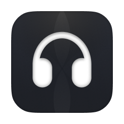
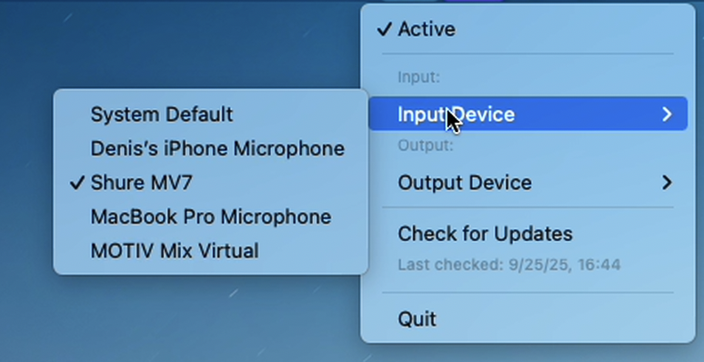

<span> <h1 style="display: inline; margin: 0; vertical-align: middle;">AudioKeeper</h1></span>

[](https://developer.apple.com/macos/)
[](https://swift.org/)
[](https://developer.apple.com/xcode/swiftui/)
[](LICENSE)

**Keeps your preferred audio devices** - no more manual switching when you connect/disconnect headphones, speakers, or microphones. Everything automatic and simple!

[](https://github.com/rekruizer/AudioKeeper/releases/latest)




## 🚀 Quick Start

1. **Download** → **Install** → **Launch**
2. Find the 🎧 icon in your menu bar
3. Select your preferred devices and enjoy!


## ✨ Features
Everything is simple!
- 🔄 **Automatic Device Management** - Choose your devices, that will be kept as output/input devices. Even if something changes.
- 💾 **Persistent Settings** - Remembers your preferences between sessions
- ⚡ **Real-time Monitoring** - Instant response to device connections
- 🎧 **Minimalistic** - Clean interface, no Dock clutter


## 📦 Installation

### Option 1: Homebrew (Recommended)
```bash
brew install --cask audiokeeper
```

### Option 2: Manual Download
1. Download from [GitHub Releases](https://github.com/rekruizer/AudioKeeper/releases)
2. **If DMG won't open**: Right-click DMG → "Open" → "Open" (bypasses security warning)
3. Open DMG and drag AudioKeeper.app to Applications
4. **If app won't launch**: Right-click AudioKeeper.app → "Open" → "Open"
5. **Remove quarantine** (recommended):
   ```bash
   sudo xattr -d com.apple.quarantine /Applications/AudioKeeper.app
   ```

> **Security Note:** macOS shows warnings for unsigned apps. This is normal and safe. AudioKeeper is open-source and malware-free.


## 🛠️ Development

```bash
# Clone and build
git clone https://github.com/rekruizer/AudioKeeper.git
cd AudioKeeper
open AudioKeeper.xcodeproj
# Press Cmd + R in Xcode
```

**Requirements:** macOS 13.0+, Xcode 14.0+, Swift 5.7+


## 🤝 Contributing

1. Fork the repository
2. Create a feature branch
3. Make your changes
4. Submit a pull request


# 💖 Support the Project

[](https://paypal.me/rekruizer)

### ₿ Crypto Donations

**Bitcoin:**
```
bc1q9xj5p220tqgdn7gxjhuc9uk39xyl59vj0qs89f
```
**Ethereum:**
```
0x89D36cA00D690f294ebEaB81276062BCd9a5E8D0
```
**USDT:**
```
0x89D36cA00D690f294ebEaB81276062BCd9a5E8D0
```

*Your support helps me continue building!* 💙
- 🚀 Continue development and new features
- 🐛 Fix bugs and improve stability
- 📚 Create better documentation
- ⚡ Keep the project maintained


### 📄 License

MIT License - see [LICENSE](LICENSE) for details.

### 🆘 Support

- 🐛 **Bug Reports**: [GitHub Issues](https://github.com/rekruizer/AudioKeeper/issues)
- 💡 **Feature Requests**: [GitHub Discussions](https://github.com/rekruizer/AudioKeeper/discussions)